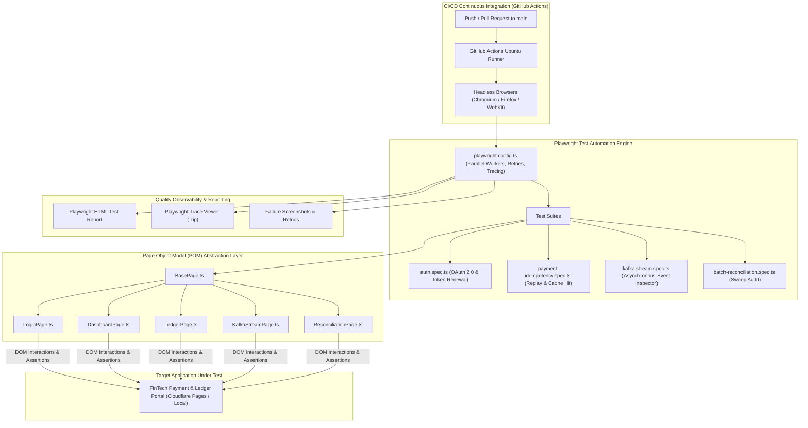

# FinTech Playwright & TypeScript E2E Test Platform

[](https://github.com/itfreesource-academy/fintech-playwright-ts-harness/actions)


An enterprise-grade **Playwright + TypeScript** end-to-end test automation platform engineered to validate mission-critical financial user journeys, strict transactional idempotency, asynchronous Kafka stream rendering, and OAuth 2.0 authentication flows.

Engineered by **[Vishal Prajapati](https://defendloop.io)** (*Senior Automation & Tools Development Engineer*) to showcase production-grade UI automation architecture tailored to modern FinTech distributed scale (aligning with Moniepoint's Quality Engineering standards).

---

## 🏛️ Architecture & Page Object Model (POM)



---

## 🎯 Test Scenarios & Domain Capabilities Covered

### 1. Financial Idempotency & Zero-Debit Guarantee (`payment-idempotency.spec.ts`)
* **Scenario A (Fresh Settlement):** Submits a valid transfer request, asserts HTTP `201 CREATED` status badge, verifies operating balance decrement, asserts immediate ledger insertion, and verifies dynamic generation of a new `Idempotency-Key` for the subsequent payment.
* **Scenario B (Idempotent Retry Storm):** Re-transmits the identical `Idempotency-Key` header, asserting the system responds with `200 OK (IDEMPOTENT CACHE HIT)` and—critically—**verifies the operating balance is NOT debited twice**, preventing disastrous double-charge events.

### 2. OAuth 2.0 Identity & Session Security (`auth.spec.ts`)
* Verifies unauthenticated visitors are gated behind the OAuth 2.0 Client Credentials modal.
* Simulates Client ID and Secret authentication, validating successful token generation and Bearer injection.
* Tests session termination via logout, ensuring immediate revoking of client session state.

### 3. Asynchronous Kafka Event Stream Validation (`kafka-stream.spec.ts`)
* Validates that payment actions emit structured JSON events to the `fintech-payment-events` topic partition.
* Verifies real-time parsing of partition offsets, timestamps, and payload attributes (`amount`, `currency`, `destinationAccount`).
* Asserts that duplicate transfer retries emit `IDEMPOTENT_RETRY_DETECTED` audit signals.

### 4. End-of-Day Account Reconciliation (`batch-reconciliation.spec.ts`)
* Triggers batch pooling account sweeps across ledger records, asserting zero audit discrepancies and a `BALANCED` status report (modeled after State Bank of India's automated calculation engine).

---

## 📂 Project Directory Structure

```
fintech-playwright-ts-harness/
├── .github/
│   └── workflows/
│       └── ci.yml                 # Automated GitHub Actions CI workflow
├── src/
│   └── pages/
│       ├── BasePage.ts            # Common locator utilities & navigation
│       ├── LoginPage.ts           # OAuth 2.0 login modal interactions
│       ├── DashboardPage.ts       # Transfer form, metrics cards, terminal inspector
│       ├── LedgerPage.ts          # Settled transactions table & export controls
│       ├── KafkaStreamPage.ts     # Real-time event partition inspector
│       └── ReconciliationPage.ts  # End-of-day batch reconciliation
├── tests/
│   ├── auth.spec.ts               # OAuth 2.0 authentication suite
│   ├── payment-idempotency.spec.ts# Financial idempotency & replay suite
│   ├── kafka-stream.spec.ts       # Kafka event stream validation suite
│   └── batch-reconciliation.spec.ts# Batch sweep audit suite
├── package.json                   # Scripts, devDependencies, and metadata
├── playwright.config.ts           # Playwright runner configuration
├── tsconfig.json                  # TypeScript compiler settings
└── README.md
```

---

## 🚀 Getting Started

### 1. Prerequisites
* Node.js 18+ or 20+ LTS
* npm or pnpm

### 2. Installation
```bash
# Clone the repository
git clone https://github.com/itfreesource-academy/fintech-playwright-ts-harness.git
cd fintech-playwright-ts-harness

# Install dependencies
npm install

# Install Playwright browser binaries
npx playwright install --with-deps
```

### 3. Executing Tests
```bash
# Run all E2E test suites headless
npm test

# Run tests in interactive UI mode (Time-travel debugging)
npm run test:ui

# Run tests with visible browser window
npm run test:headed

# Run against a specific browser
npm run test:chromium
npm run test:firefox
npm run test:webkit
```

### 4. Testing Against Production / Cloudflare Pages
To point tests to your live Cloudflare Pages deployment:
```bash
BASE_URL="https://fintech-payment-portal.pages.dev" npm test
```

### 5. Viewing Test Reports
```bash
npm run report
```

---

## 🔗 Related FinTech Showcase Ecosystem
* **[fintech-payment-portal](https://github.com/itfreesource-academy/fintech-payment-portal):** The live FinTech web application with client-side OAuth, idempotency engine, and Kafka inspector (deployed to Cloudflare Pages).
* **[fintech-test-platform-harness](https://github.com/itfreesource-academy/fintech-test-platform-harness):** Enterprise Java 17, REST Assured, WireMock, and Apache Kafka (with Awaitility) test platform.

---

## 👤 Author
* **Vishal Prajapati** — *Senior Associate: Test Automation & Tools Development Engineer*
* **Portfolio:** [defendloop.io](https://defendloop.io)
* **LinkedIn:** [linkedin.com/in/vishalprajapati2k25](https://www.linkedin.com/in/vishalprajapati2k25)
* **Education & Community:** Founder of [ITFreeSource Academy](https://academy.itfreesource.com)
